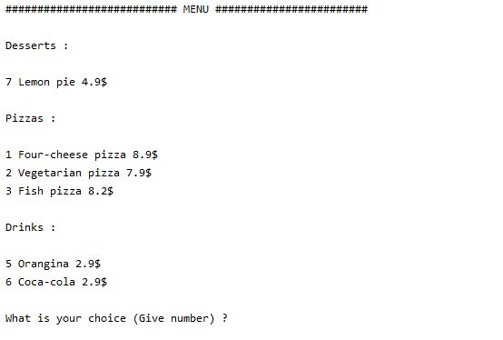
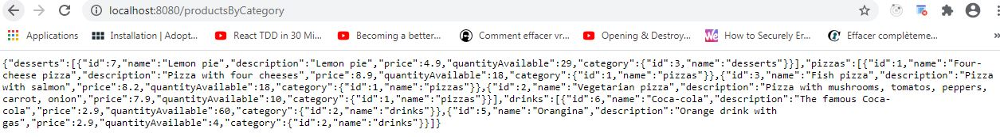

## Clean architecture : Pizza Automate

### Description project

This project was made to show hexagonal architecture power. It's a simple automate for customers who want to buy pizzas/drinks/desserts...
The customer goes to the automate (a touchscreen), then he chooses what he wants to eat (products/quantity). After the order, he can
pay this one by coins or by bank card. Finally, the automate gives the order to the customer. 

### Hexagonal architecture

Thanks to the hexagonal architecture, we can focus only in the business logic of the application without knowing 
frameworks, libraries used. Indeed, what matter if it is MySQL or MongoDB or filesystem used, the business logic
will stay the same without edit it. The philosophy stays the same with "tools frontal" like Spring Boot Rest controller
or Java FX/Swing or console... If tomorrow, i want to switch Java Swing by Java FX without change the business logic or
the persistence layer, i can do it and easily ! This is the power of the hexagonal architecture.
Moreover, thanks to the hexagonal architecture, you can focus easily on TDD and BDD (DDD too, i didn't use it in this project).

Some avantages :

* The business logic is independent

* Maintenance and Evolutions are easy to do

* We can test without to worry about frameworks and infrastructures used

* Dependency inversion used

Some cons :

* Not practical for little application

#### With Console

#### With REST Spring Boot

